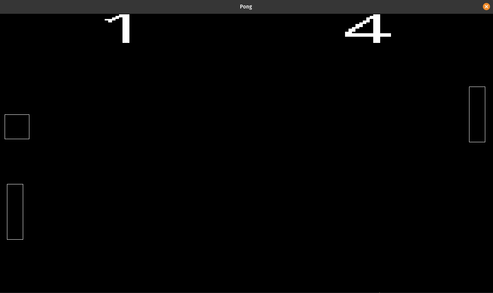

# Pong example

A super simple demo to proof-of-concept what using this ECS library
might look like in a simple game. Using an ECS library is of course a bit
overkill for a Pong game, but it gets the idea across well enough.

### Controls
W/S to move Player 1's paddle, Up/Down arrows to move Player 2's paddle. Space
pauses the game.

### Prerequisites

You must have SDL2, SDL_ttf, and their dev dependencies available on your system.

DISCLAIMER: I have likely only built this example on Linux, specifically
Pop!_OS 20.10. You have been warned.

### Building the game

From within this directory, run `zig build demo`
